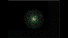

# Particle Explosion with SDL2 and C++

This project is the final project from [John Purcell's Free C++ Udemy Course](https://www.udemy.com/course/free-learn-c-tutorial-beginners/). It is a particle explosion-implosion cycle with changing colors and box blur effect. The following build is for windows however can be built and run on Linux & MacOS (with additional setup)

# Building & Running

The project was developed and build (initially) on **Windows**. To build/run it in MacOS or Linux based systems, you must install and setup SDL2 for your respective system and include the proper files in the `include/SDL2`, `lib/`, `bin/` folders.

### Windows
Navigate to `bin/` and run

    mingw32-make

### Unix/Linux

    make

This will create the appropriate executable in `bin/`.
